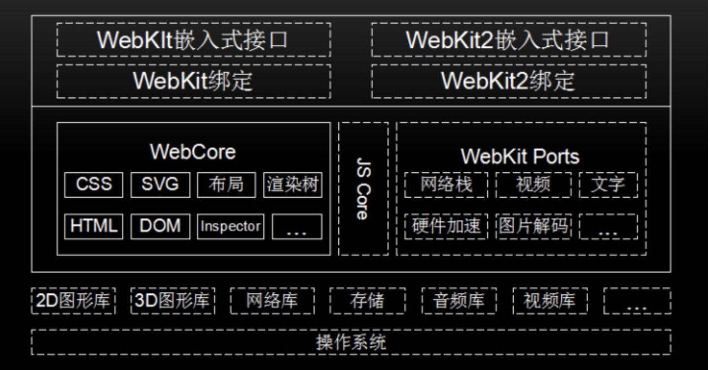
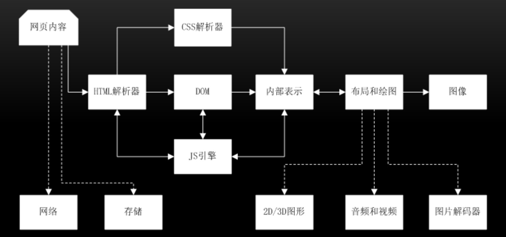

### v8内部图

### 网页渲染流程

### 输入url到dom树
- 地址栏输入URL，webkit调用资源加载器加载相应的资源
- 加载器依赖网络模块建立连接，发送请求并接受答复
- webkit接受各种网页或者资源数据，其中某些资源可能同步或者异步获取
- 网页交给html解析器转变为词语
- 解释器根据词语构建节点，形成dom树
- 如果节点是JavaScript代码，调用JavaScript引擎解释并执行；
- JavaScript代码可能会修改DOM树结构；
- 如果节点依赖其他资源，如图片\css、视频等，调用资源加载器加载它们，但这些是异步加载的，不会阻碍当前DOM树继续创建；如果是JavaScript资源URL（没有标记异步方式），则需要停止当前DOM树创建，直到JavaScript加载并被JavaScript引擎执行后才继续DOM树的创建