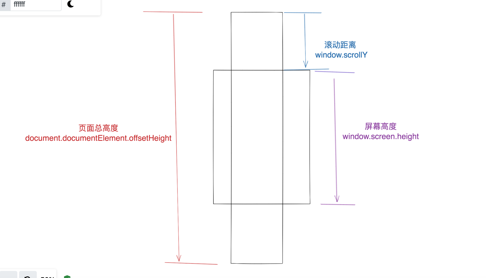
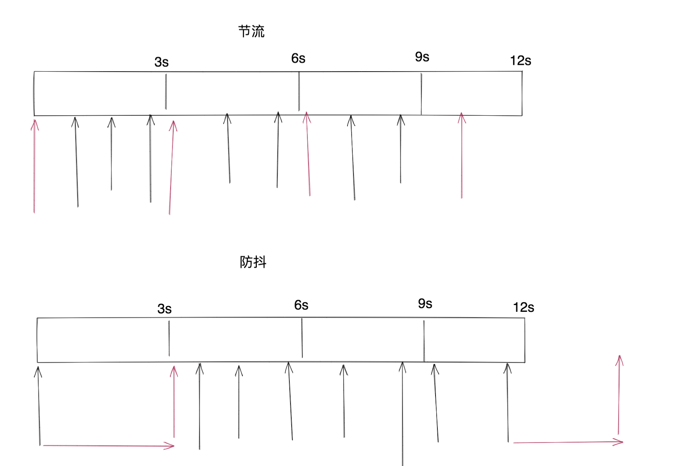

### 待查阅
- nodemon是什么
- 编译原理 静态分析


# 05.01 【讲义】ES6 项目实战
# 本节课整体介绍
- ES6 module
- 并发请求
- class
- 装饰器
- 请求的封装
- express 简单中间件处理

# ES6 module 与 CommonJs的区别

值的引用和值的拷贝 treeshaking机制不一样，esmodule是有treeshaking机制的


分开导出，可以使用tree shaking机制
export default 和 export 区别在于，默认导出，在引用的时候，会全部加载，普通导出，在导入的时候，只会按需引入

值的引用和值的拷贝
es6 module  值的引用
```javascript
//a.js
export const token = '1'
export const getToken = () => {
  console.log('token');
}

setTimeout(() => {token = '2'}, 1000);

//b.js
import {token} from './a';

console.log(token) // 1;
setTimeout(() => {console.log(token)}, 1000); //'2';
```
Commonjs 值的拷贝
```javascript
//a.js 改写为 commonjs导出的格式有哪些，查一下资料
module.exports = {
  get token() {
    return token;
  }
} 
```
```
// util.js
export let token = null

export const getToken = () => {
  console.log('get Token')
}

setTimeout(() => {
  token = 'token value'
}, 1000)
```

```
// import {token} from './util'
const {token} = require('./util')

console.log('token', token)

setTimeout(() => {
  console.log('token', token)
}, 2000)

```


## tree-shaking
tree-shaking：不同，ES6 不装载不需要的模块，webpack production模式使用tree-shaking直接删除；module.exports导出的是一个整体的对象 require也是一个整体的对象

注意：export default 对象被 import 后，挂在 default 上的属性和方法，即使没有被调用，也无法被 tree-shaking，所以我们在组织模块文件时，应当尽可能避免 export default {A, B, C} 的写法。export const xxx = {} 同理。

```
export default {
  request() {
    console.log('request')
  },
  response() {
    console.log('response')
  }
}
```
```
import util from './util'
console.log(util.request)
```
### vue2与3写法的变化
```
// 2.x
import Vue from 'vue'
Vue.nextTick(() => {
  // 一些和DOM有关的东西
})
// vue2 导出 https://github.com/vuejs/vue/blob/dev/src/core/index.js
// export default Vue

// 3.x
import { nextTick } from 'vue'
nextTick(() => {
  // ...
})
// vue3 导出 https://github.com/vuejs/vue-next/blob/master/packages/vue/src/index.ts
// export { compileToFunction as compile }
// export * from '@vue/runtime-dom'
```

## 值的引用 or 值的拷贝
module.exports require 如果修改了变量，则require中的不变

## ES6 module 与 CommonJs的用法
### module.exports require 
module.exports = {

}
module.exports.xxx = ''

module = {} // wrong,其他模块require后获取不到这里的导出的

### export import
export const request = xxx
or
const request = 'xxx'
export { request }


# http模块的封装

## 获取token
```
// util.js
import axios from "axios";

export let token = null

let getTokenPromise = null

export const getToken = () => {
  if(!getTokenPromise) {
    getTokenPromise = axios.get('/api/token').then(res => {
      token = res.data.token
      return token
    })
  }

  return getTokenPromise;
}

```

## 请求头添加token
// http.js
```
import axios from 'axios'
import {token, getToken} from './util'

const instance = axios.create({
  baseURL: '/api'
})

instance.interceptors.request.use(async config => {
  let headerToken = token
  if(headerToken) {
    console.log('token已存在', headerToken)
  } else {
    console.log('token不存在发起请求')
    headerToken = await getToken()
  }
  config.headers.token = headerToken
  return config
})

instance.interceptors.response.use(res => res.data)

export const getTabs = () => instance.get('/tabs')

export const getNewsList = () =>  instance.get('/news/list')

```

## 服务端验证token
```
app.use('/api', function(req, res, next) {
  if(req.path === '/token' || req.headers.token === '42gd2') {
    next()
  } else {
    next('invalid token')
  }
})

// ...

app.use('/api', function(err, req, res, next) {
  res.send({
    error: 1,
    message: err
  })
})

```


## 客户端并发请求
```
// Promise.all
const [tabs, newsList] = await Promise.all([getTabs(), getNewsList()])

// or await
const tabsTask = getTabs()
const newsTask = getNewsList()

const tabs = await tabsTask
const newsList = await newsTask
```

## 避免发送重复请求
```
import axios from 'axios'

const peddingMap = new Map()

export const addPeddingRequest = (config) => {
  const {url, method} = config

  const mapKey = [url, method].join('&')

  if(peddingMap.has(mapKey)) {
    const cancel = peddingMap.get(mapKey)
    cancel(mapKey)
    peddingMap.delete(mapKey)
  }

  config.cancelToken = new axios.CancelToken(cancel => {
    peddingMap.set(mapKey, cancel)
  })
}

export const deletePeddingRequest = (config) => {
  const {url, method} = config

  const mapKey = [url, method].join('&')

  peddingMap.delete(mapKey)
}

// http.js
instance.interceptors.response.use(res => {
  deletePeddingRequest(res.config)
  return res.data
}, error => {
  if(axios.isCancel(error)) {
    console.error('此请求被取消', error)
  }
  return Promise.reject(error)
})
```


# App
```
class App {
  constructor({root}) {
    this.root = root;
    this.init()
  }
  init() {
    this.requestData()
  }

  async requestData() {
    // const [tabs, newsList] = await Promise.all([getTabs(), getNewsList()])
    const tabsTask = getTabs()
    const newsTask = getNewsList()

    const tabs = await tabsTask
    const newsList = await newsTask

    console.log(tabs, newsList)

    new Tab(tabs).mount(this.root)
    new NewsList(newsList).mount(this.root)
  }
}

new App({root: document.body})
```

# Component
```
export default class Component {
  constructor(data) {
    this.props = {
      data,
    }
  }
  constructElement() {
    const html = this.render()
    const $container = document.createElement('div')
    $container.innerHTML = html

    this.$el = $container.firstChild
  }
  mount($container) {
    if(!this.$el) {
      this.constructElement()
    }
    $container.appendChild(this.$el)
  }

  render() {
    return null
  }
}
```

## 实现新闻列表
```
import Component from './component'

export default class NewsList extends Component {
  render() {
    const {data: newsList} = this.props.data
    return(
      `<ul>
        ${newsList.map(news => {
          return (
            `
              <li>
                <h3>${news.title}</h3>
                
              </li>
            `
          )
        }).join('')}
      </ul>`
    ) 
  }
}
```

### 新闻列表滚动加载
 

```
listenScroll() {
  const DISTANCE = 100
  window.addEventListener('scroll', () => {
    const scrollY = window.scrollY
    const screenHeight = window.screen.height
    const domHeight = document.documentElement.offsetHeight

    if(domHeight - (scrollY + screenHeight) < DISTANCE) {
      this.appendList()
    }
  })
}

async appendList() {
  console.log('appendlist')
  const newsList = await getNewsList()
  new NewsList(newsList).mount(this.root)
}
```

### 防抖与节流的区别
以时间为3秒为例
防抖：关键词——等待，等待3秒内没有新的action，就执行
节流：关键词——丢弃，三秒内的action只执行一次，其余的action会被丢弃

 

### 普通节流
```
// util.js
export function throttle(func, timeout = 1000) {
  let done = false
  return (...args) => {
    if(!done) {
      func.call(this, ...args)
      done = true
      setTimeout(() => {
        done = false
      }, timeout)
    }
  }
}

// index.js
constructor({root}) {
  this.root = root;
  this.init()

  this.appendList = throttle.call(this, this.appendList, 500)
}
```

### 装饰器实现节流
```
// util.js
export const decoratorThrottle = (timeout = 1000) => {
  return (targetPrototype, propName) => {
    const oldMethod = targetPrototype[propName]
    let lastActionTime = 0
    targetPrototype[propName] = function(...args) {
      const currentTime = Date.now()

      if(currentTime - lastActionTime > timeout) {
        oldMethod.call(this, ...args)
        lastActionTime = currentTime
      }
    }

    return targetPrototype
  }
}

// index.js
  @decoratorThrottle(500)
  async appendList() {
    console.log('appendlist')
    const newsList = await getNewsList()
    new NewsList(newsList).mount(this.root)
  }
```