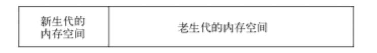
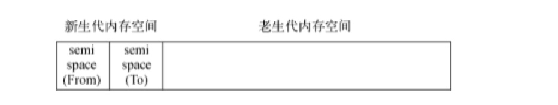
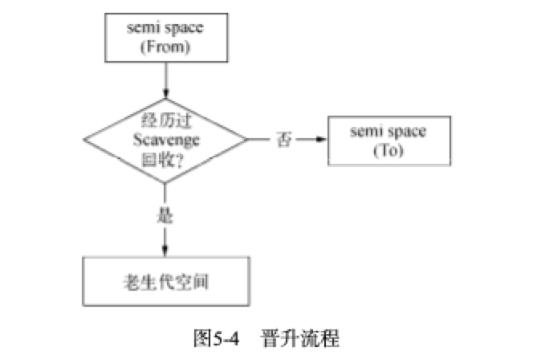
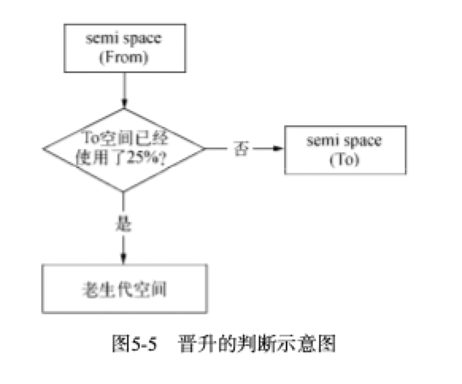
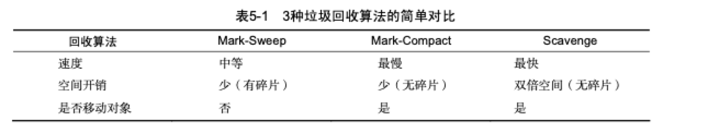
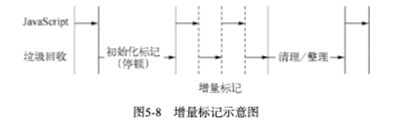

### v8的对象分配
在v8中，所有的javascript对象都是堆来进行分配的，node提供了v8中内存使用量的查看方式，执行下面的代码，将得到输出的内存信息：
```js
node
process.memoryUsage();//就可以查看内存使用情况
```
当我们在代码中声明对象变量的时候，对象所用的内存就是堆内存，如果已经申请的堆空闲内存不够分配新的对象，就会继续申请对内存，直到大小超过V8的限制为止

#### V8限制堆大小原因
在chrome中，v8限制了内存的大小（64位的约1.4G，32位的0.7G）
- 表面原因是因为V8是为浏览器设计的，不太可能遇到大量内存的情景，对于网页来说，v8的限制值已经搓搓有余了，
- **深层的原因**是**V8的垃圾回收机制**；（因为内存越大，回收时间越久也就会造成性能的影响，页面的卡顿）

官方表明的回收时间，以1.5G的垃圾回收堆内存为例，v8做一次晓得垃圾回收需要50毫秒以上，一次非增量式的垃圾回收甚至要1s以上，这就是垃圾回收引起的js线程暂停执行的时间，因此就会影响应用的性能和响应力，所以就考虑**直接限制堆内存的大小**（但是可以打开哦，启动node，传递--max-old-space-size或者--max-new-space-size）
```js
node --max-old-space-size=1700 test.js //单位MB
//或者
node --max-new-space-size=1024 test.js //单位kb
```

#### 简单介绍一下v8引擎的垃圾回收机制
在js中，绝大多数的变量存活周期都比较短，大部分在经历过一次回收之后就会释放内存，而少部分会继续存活。因此为了提高回收效率，v8就将内存分为两类，**新生代和老生代**

- **副垃圾回收器** scavenge：主要负责新生代的垃圾回收
    - 典型空间换时间的算法
    - 内存最大值：64位32M，32位16M
    
- 新生代：新创建的对象或者只经历过一次的垃圾回收的对象被称为新生代
  - 被分为from和to两个空间，to一般是闲置的，当from空间满了之后，会执行scavenge算法进行垃圾回收，当我们执行垃圾回收算法的时候，应用逻辑将会停止，等垃圾回收结束之后在继续执行。scavenge算法分为三步：
    - 首先检查from空间的存活对象，如果对象存活则判断对象是否满足晋升到老生代的条件，如果满足条件则晋升到老生代，如果不满足就移动到to空间
    - 如果对象不存活，则释放对象的空间
    - 最后将from空间和to空间角色进行交换
  - 新生代晋升到老生代的两个条件：
    - 该对象是否经历过一次scavenge回收，若经历过，则将对象从from空间复制到老生代中；如果没有，则复制到to空间 
    - To空间的内存使用占比是否超过限制，当对象从from空间复制到to空间时，若to空间使用超过25%，则对象直接晋升到老生代中。设置25%的原因主要时因为算法结束后，两个空间会交换位置，如果to空间的内存太小，会影响后续的内存分配。
    
- **主垃圾回收器** mark-sweep & mark-compact:主要负责老生代的垃圾回收 标记清除和标记整理结合使用
    - 内存最大值： 64位1400M，32位700M
- 老生代：经历过多次垃圾回收的对象称为老生代
  - 老生代采用标记清除法和标记整理法
    - 标记清除法：
      - 首先会对内存中所有对象进行遍历，对于存活的对象进行标记，标记结束后，清除哪些没有被标记的对象。由于标记清除会造成很多内存碎片，不利于后面的内存分配，所以为了解决内存碎片的问题，引入了标记压缩法
    - 标记整理法：
      - 标记整理是在标记清除的基础上演变而来的，区别在于，在整理的过程中，存活对象会忘一侧移动
      - 在标记阶段遍历全部对象，对于存活的对象会进行标记，当标记结束之后，开始整理，会将存活的对象向内存的一边移动，最后清理掉边界的内存


根据上图可知，标记清除和标记整理的区别在于一个需要移动对象，所以执行速度不会很快，因此v8的设计是主要使用标记清除，在空间不足以对从新生代晋升过来的对象进行内存分配时，才是使用标记整理法

- **增量标记**
    - 由于垃圾回收会暂停应用的逻辑，对于新生代方法由于内存小，每次停顿的时间不会太长，但是对于老生代来说，垃圾回收的时间长，停顿就会造成很大的影响。为了解决这个问题，v8引入了增量标记的方法，将一次停顿进行的过程分为了多步，每次执行完一小步就让运行逻辑执行一会，就这样交替运行。
    
    - v8在经过增量标记的改进后，垃圾回收的最大停顿时间可以减少到原来的1/6左右
    - v8后续还引入了延迟清理，增量式整理，让清理和整理的动作也变为增量的，同时还计划引入并行标记与并行整理，进一步利用多核性降低每次停顿的时间

### v8当前垃圾回收机制
2011年，v8使用了增量标记，直到2018年，chrome64和nodejs v10都启动了并发标记，同时在并发的基础上添加并行技术，使得垃圾回收大幅度缩短

#### v8主要的垃圾回收算法
v8的垃圾回收策略主要基于**分代式**垃圾回收机制

#### 内存泄漏
- 意外的全局变量
  - 使用了为声明的变量，就会意外的创建一个全局变量，就会使得这个变量一直留在内存中而无法被回收
- 被遗忘的计时器或回调函数
- 脱离DOM的引用
  - 我们获取了一个dom元素的引用，后面这个元素被删除了，但是由于我们保留了引用，他就无法被回收
- 闭包


### 内存生命周期
在js定义变量的时候，就完成了**内存分配**

#### 使用值
**使用值的过程**就是对**分配的内存进行读取与写入**，读取与写入可能是一个变量货对象的属性值，也可以是传递函数的参数


