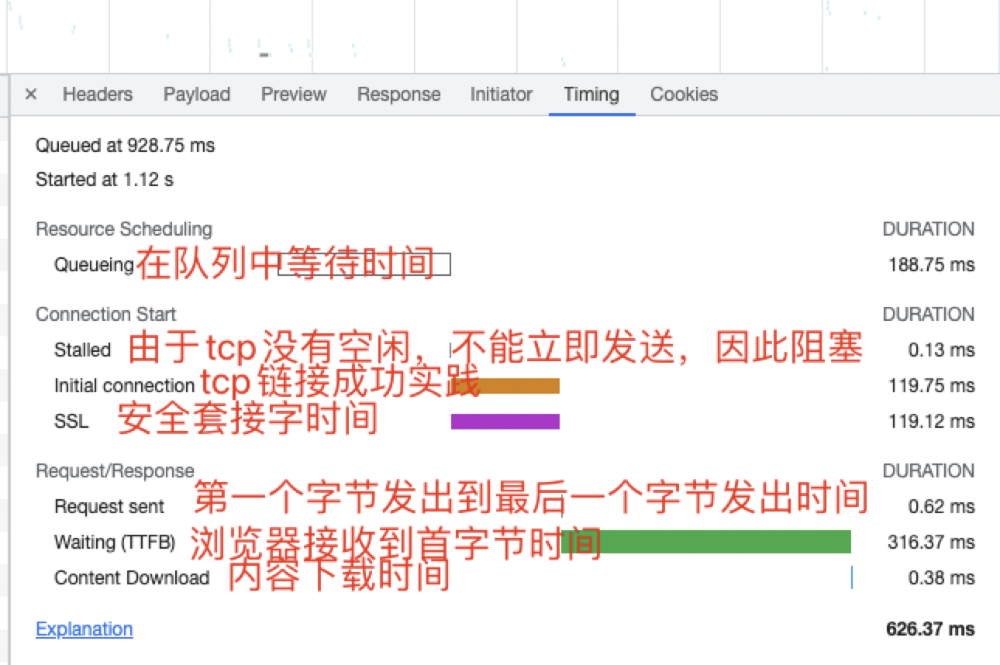

### network timing 分析

参数具体意义：

- Queueing：请求文件的顺序排序，浏览器有最大发送请求的限制，比如 chorme 最大限制六个，因此大于六个就会把请求加入队列；因此该参数表明**添加到处理队列，到实际开始处理的时间间隔**
- Stalled：阻塞；**浏览器得到要发出该请求的指令，到请求可以发出的等待时间**，造成阻塞的原因有，代理协商，等待可复用的 tcp 链接释放的时间
- DNS Lookup：dns 解析时间，可以通过 dns 缓存，利用 connection: keep-alive 建立持久连接
- initial connection：**建立 tcp 连接时间**，相当于请求发送到 tcp 三次握手完成
- SSL：**安全套接字时间**，https 请求，加密
- Request sent：发送请求，发送 http 请求的时间，（从第一个字节发出，到最后一个字节发出后的时间）
  - 减少 http 请求，可以使用 css sprites, 内连图片，合并脚本，内连样式
  - 对不长变化的组件，添加缓存永久有效时间
- waiting（TTFB）：请求发送后，收到响应的第一个字节所花费的时间，发送完请求到开始接受请求的时间
  - 影响因素：线路、服务器距离、后台服务性能，MySQL 查询等
- content download：**收到响应的第一个字节和接受最后一个字节的时间**，就是内容下载时间
  - 资源大小、是否使用缓存

## 减少 http 请求

## 减少资源大小

- 压缩：服务端压缩，js css html 压缩，http2 首部字段压缩
- webp
- 开启 gzip

## 优化网络连接

- 使用 cdn，分发资源，请求的时候，就近请求
- 使用 dns 预解析
- 并行连接
- 持久连接： connection: keep-alive
- 管道化连接

## 优化资源加载

- 资源加载位置，如 js 放底部，使用 async,defer 等异步加载
- 资源加载时机：按需加载
- 使用资源预加载和资源预读取
- 资源懒加载

## 减少重绘和回流

- 样式设置
- 渲染层
- dom 优化

## webpack 打包
